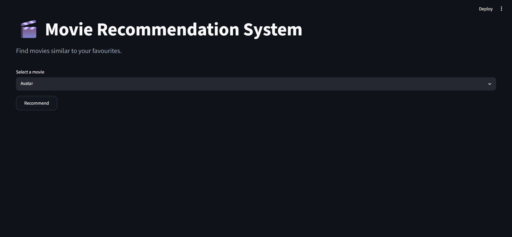
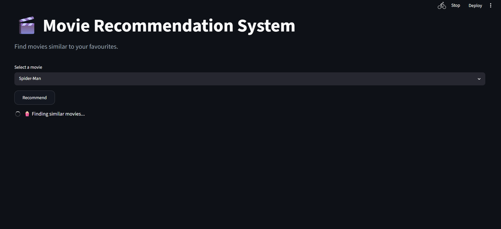

# 🎬 Movie Recommendation System

A Content-Based Movie Recommendation web application that suggests movies similar to your favourite movies.

Built using:

* Python
* Pandas
* Scikit-Learn
* Natural Language Processing (NLP)
* TMDB API
* Streamlit

---

## Demo

Select a movie from the dropdown and the system will recommend **5 similar movies** along with:

* 🎬 Movie Poster
* 📅 Release Date
* 📝 Overview

---

## Features

* Content-Based Movie Recommendation
* Similar movie suggestions
* Movie posters using TMDB API
* Release dates and overviews
* Interactive Streamlit UI
* Fast recommendations using precomputed similarity matrix

---

Model Files

Due to GitHub's 100 MB file size limit, the trained model files are not included in this repository.

The following files need to be generated locally:

1. movies.pkl
2. similarity.pkl

How to generate the files?

Run the notebook: movie-recommender-system.ipynb

or execute all notebook cells to create:

movies.pkl
similarity.pkl

After generating these files, place them in the project's root directory

---

## Tech Stack

* Python
* Pandas
* NumPy
* Scikit-Learn
* NLTK
* Streamlit
* TMDB API

---

## Machine Learning Pipeline

1. Load movie and credits datasets
2. Merge datasets
3. Data preprocessing and cleaning
4. Extract important features:
   * Genres
   * Keywords
   * Cast
   * Crew
   * Overview
5. Create movie tags
6. Apply text preprocessing
7. Convert text into vectors using Count Vectorizer
8. Compute Cosine Similarity Matrix
9. Recommend movies based on similarity scores

---

## Project Structure

```text
movie-recommender-system/
│
├── app.py
├── movie-recommender-system.ipynb
├── movies.pkl
├── similarity.pkl
├── tmdb_5000_movies.csv
├── tmdb_5000_credits.csv
├── requirements.txt
├── README.md
└── .gitignore
```

---

## Installation

Clone the repository:

```bash
git clone https://github.com/Mahima-khetiya812/Movie-Recommender-System
cd movie-recommender-system
```

Install dependencies:

```bash
pip install -r requirements.txt
```

Run the application:

```bash
streamlit run app.py
```

---

## Dataset Information

* **Movies Dataset:** TMDB 5000 Movie Dataset
* **Total Movies:** ~5000
* **Recommendation Technique:** Content-Based Filtering
* **Similarity Measure:** Cosine Similarity

---

## 📸 Screenshots






---

## Limitations

* Recommends movies only based on content similarity.
* Does not consider user ratings or user preferences.
* New movies outside the dataset cannot be recommended.
* Similarity matrix file is large and may require optimization for deployment.

---

## Author

**Mahima Khetiya**

Aspiring Data Scientist

If you found this project helpful, consider giving it a ⭐ on GitHub.